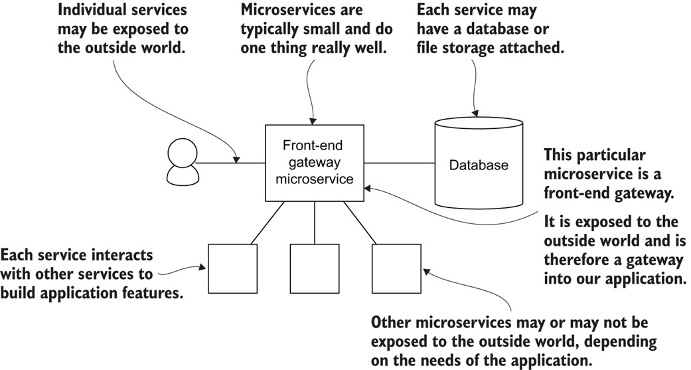

# Microservices?

We will adopt this book [Bootstrapping Microservices, Second Edition: With Docker, Kubernetes, GitHub Actions, and Terraform 2nd Edition](https://www.amazon.com/Bootstrapping-Microservices-Second-Kubernetes-Terraform/dp/1633438562/ref=sr_1_4) and adopt it for our course by using Python and FastAPI

## What is a Microservice?

A **microservice**, also known as a **microservice architecture**, is a way of building software applications as a collection of **small, independent services** that work together. These services are:

* **Independently deployable:** Each service can be deployed and updated separately without affecting other parts of the application.
* **Loosely coupled:** Services communicate with each other through well-defined APIs, minimizing dependencies and making them easier to maintain and modify.
* **Focused on specific functionality:** Each service performs a single, well-defined task, promoting modularity and reusability.

Here's an analogy to help understand microservices: Imagine building a car. Traditionally, you might build the entire car as one unit, with the engine, transmission, and wheels all tightly coupled. This is similar to a **monolithic architecture** in software development.

With microservices, you would instead build the car as a collection of independent modules:

* **Engine service:** Responsible for starting, stopping, and controlling the engine.
* **Transmission service:** Handles gear changes and power transfer.
* **Wheel service:** Controls the movement and direction of each wheel.

These modules would communicate with each other through well-defined interfaces, allowing them to be developed, tested, and deployed independently.

**Benefits of using microservices:**

* **Increased agility and faster development:** Easier to make changes and deploy new features.
* **Improved scalability and fault tolerance:** Individual services can be scaled independently and failures are contained within specific services.
* **Enhanced maintainability and flexibility:** Easier to understand, modify, and update individual services.

**However, microservices also come with challenges:**

* **Increased complexity:** Managing distributed systems can be more complex than monolithic applications.
* **Potential for higher operational overhead:** Requires additional effort to monitor, log, and troubleshoot issues across multiple services.
* **Need for robust communication and API management:** Efficient communication and API design are crucial for successful implementation.

Overall, microservices offer a powerful approach for building modern, scalable, and maintainable software applications. 

## Should a microservice be owned and operated by a single developer or a team of developers?

While a single developer can technically manage a microservice, it is generally more effective and sustainable for a small, cross-functional team to own and operate each microservice. This approach leverages the benefits of diverse skills, collaborative problem-solving, and shared responsibility.

In a microservices architecture, **ownership and operation typically fall on a team of developers rather than a single individual**. Here's why:

**Benefits of team ownership:**

* **Shared knowledge and expertise:** A team brings diverse skills and perspectives to the table, leading to better decision-making and problem-solving.
* **Improved code quality and maintainability:** Collaboration fosters code reviews, knowledge sharing, and collective ownership, leading to higher quality and maintainable code.
* **Increased efficiency and scalability:** Distributing ownership across a team allows for parallel work, faster development cycles, and easier scaling as the service evolves.
* **Reduced risk:** If a single developer leaves or becomes unavailable, the team's collective knowledge ensures continuity and minimizes disruption.

**While a single developer might initially build a microservice, long-term ownership by a team is generally recommended.** This fosters accountability, promotes knowledge sharing, and ensures the service's continued success even amidst personnel changes.

**However, there are nuances to consider:**

* **Team size:** For very small services, a smaller dedicated team or even a single developer with strong ownership might be sufficient.
* **Complexity:** More complex services with extensive dependencies may benefit from a larger team with specialized skills.
* **Organizational structure:** Some organizations might have established practices or team structures that influence ownership models.

Ultimately, the ideal ownership structure depends on your specific context and the characteristics of your microservices. Consider factors like team size, service complexity, and organizational culture when making this decision.

## Microservice Accessibility and Persistence:

**Microservices can be categorized based on their accessibility and data persistence:**

**1. Public Microservice:**

* **Description:** Exposed to the external world, allowing customers or other applications to interact with it directly.
* **Example:** An e-commerce platform's "Product Search" service.

**2. Internal Microservice:**

* **Description:** Not directly accessible from outside the system, used for internal communication and functionalities.
* **Example:** An e-commerce platform's "Order Processing" service.

**3. Hybrid Microservice:**

* **Description:** May have both public and internal functionalities, with specific endpoints exposed externally.
* **Example:** An e-commerce platform's "User Management" service offering public login/registration and internal account management APIs.

**Data Persistence:**

* **Microservices typically have access to some form of data persistence:**
    * **Database:** Most common, storing structured data in relational or NoSQL databases.
    * **File Storage:** Used for storing unstructured data like images, documents, etc.
    * **Cache:** Temporary storage for frequently accessed data to improve performance.

    
